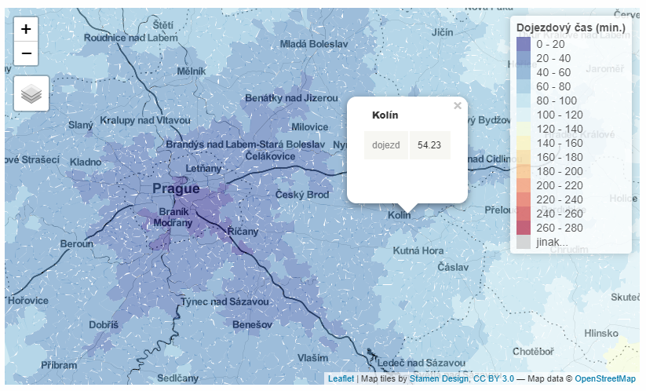

# Pražské Isochrony

  

Před časem jsem na svém blogu publikoval [napůl vážně míněnou analýzu](http://www.jla-data.net/cze/cesta-z-mesta/) dojezdové vzdálenosti do obchodního centra [Arkády Pankrác](http://www.arkady-pankrac.cz/about-us) ze všech obcí České Republiky (kterých je něco málo přes šest tisíc).

K mému překvapení se tento článek sešel s nečekaně pozitivní odezvou, a stal s přehledem nejpopulárnějším příspěvkem z blogu. Z několika stran jsem byl požádán o zdrojový kód. Věřím v sílu Open Source, a rád se proto o zdroják podělím.

Mám k tomu pár komentářů, vesměs technických:  

* kód je napsaný v erku, což nemusí být každého šálek kávy; s tím bohužel nejde nic dělat...
* dvě knihovny - `ggmap`a `gmapsdistance` jsou na CRANu s chybami, je třeba použít GitHubovou verzi (kód pro instalaci je v komentáři ve skriptu)
* do kódu je třeba doplnit vlastní [API klíč](https://leafletjs.com/) pro Google API, což je placená služba.  
Svobodný software mám za *free* spíše v kontextu *free speech* nežli *free beer* - a sám rád piju za své :)
* v kódu je možné změnit lokalitu cíle cesty v proměnné `pupek_sveta` - ta se následně ogeokóduje přes Google, který snese i trošku robustnější zacházení. Možno uvézt adresu, nebo třeba název budovy.  
"Kramářova vila" je platný cíl, stejně jako "Pankrácká věznice" či "Mauzoleum VI Lenina".
* výstupem je soubor `vystup.html` v mapou v [leafletu](https://leafletjs.com/).  
Je opravdu hodně velký (~ 100 MB) ale optimalizace velikosti polygonů obcí byla nad mé možnosti quick and dirty zveřejnění (článek na blogu je prohnaný přes zmenšovátko [Mapshaper](http://mapshaper.org/))
* počítejte s tím, že výpočet má nějaký doběh; když to pouštím v cloudu na AWS, kde propustnost sítí zpravidla není téma, tak to běží klidně hodinu. Mějte proto trpělivost...